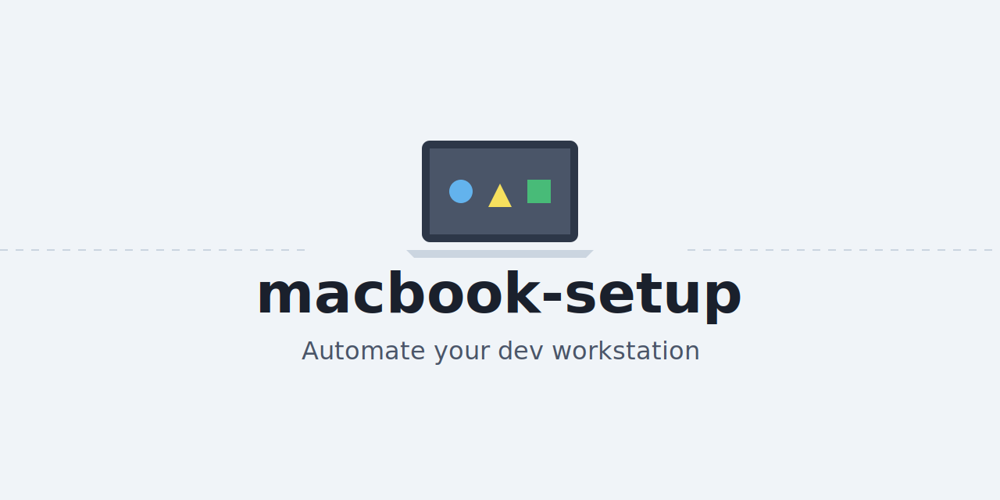

# macbook-setup



Automate the full bootstrap of a development workstation with a single Ansible playbook. The repository provisions macOS, Linux, and Windows hosts with the same core toolchain, copies opinionated configuration files (VS Code settings, oh-my-posh prompt), and installs all daily-driver apps with the native package managers for each platform.

## Goals
- **Max autonomy** – one `bootstrap` command installs Ansible (if needed) and runs the playbook locally.
- **Cross-platform parity** – common tooling lives in `roles/common`, OS-specific package management lives in `roles/{macos,linux,windows}`.
- **Idempotency & resiliency** – re-running the playbook is safe; missing apps are retried, and failures on optional casks/packages are reported without halting the run.
- **Easy maintenance** – software lists and configuration artifacts sit in predictable paths so you can edit them without reading Ansible internals.

## Toolchain Overview
- **Bootstrap CLI (`bootstrap.py`)** is a Typer-based command line experience exposed via `./bootstrap.sh`. It validates prerequisites (Python 3.9+, Typer), can install them automatically on macOS/Linux, supports `--help`, `--dry-run`, and `--log-file` flags, and prints a colorized stage-by-stage summary at the end of each run.
- **Ansible** orchestrates everything in pull/local mode (`inventory` targets `localhost`).
- **Homebrew (macOS), apt + Snap (Linux), Chocolatey (Windows)** handle software installation.
- **VS Code** receives customized settings plus extension installs via CLI.
- **oh-my-posh** aligns shell prompts across PowerShell, bash, and zsh with `roles/common/files/oh-my-posh/theme.json`.

## Repository Layout
```
bootstrap.sh / bootstrap.ps1   # one-click entry points for macOS/Linux or Windows
main.yml                       # central play defining role order
inventory                      # local-only inventory
roles/
  common/                      # cross-OS config (directories, VS Code, shell theme)
  macos/                       # Homebrew formulas + casks + Nerd Fonts
  linux/                       # apt + Snap installs, CLI bootstrappers (uv, nvm, bun)
  windows/                     # Chocolatey installs + Nerd Font deployment
roles/common/files/vscode/*    # VS Code settings JSON
roles/common/files/oh-my-posh  # prompt theme
requirements.yml               # Ansible collections (community.general, community.windows, chocolatey)
```

## Included Software
All platforms aim to install the following (method varies by OS):
- Developer tooling: Git, AWS CLI/CDK, Docker Desktop/CLI, lazydocker, btop, uv, nvm, Bun, oh-my-posh, GitHub Copilot CLI, Google Gemini CLI.
- IDEs & editors: VS Code (with extensions), Cursor, WindSurf.
- Browsers: Google Chrome, Firefox, Zen Browser.
- Communication: Slack, WhatsApp, Discord, Rambox, Bitwarden, Claude Code, Google AntiGravity (placeholder), Google Antigravity is attempted via best-effort cask/Chocolatey install and may require manual handling.
- Desktop Apps: Github Desktop.
- Fonts: `MartianMono Nerd Font Mono` and `Droid Sans Mono`.

Some titles (e.g., Google AntiGravity or bleeding-edge IDEs) do not yet have stable packages in every ecosystem. The roles attempt installation and log any failures so you can patch the package source once official formulas/casks/packages appear.

## VS Code Profile
`roles/common/files/vscode/settings.json` contains opinionated defaults (format-on-save, Nerd Font usage, Ruff/Biome formatters, telemetry opt-out). Extensions installed via CLI include:
`biomejs.biome`, `charliermarsh.ruff`, `pyre-check.pyre-check` (PyreFly), `oderwat.indent-rainbow`, `prisma.prisma`, `shd101wyy.markdown-preview-enhanced`, `dsznajder.es7-react-js-snippets`, `ms-vscode-remote.remote-containers`, `ms-vscode.remote-explorer`, `ms-vscode.remote-server`, `github.copilot`, `github.copilot-chat`, `openai.openai-codex`, `figma.figma-vscode`, `bradlc.vscode-tailwindcss`, `amazonwebservices.aws-toolkit-vscode`, `ms-vscode.powershell`, `dbaeumer.vscode-eslint`, `astral-sh.pyright`, `ms-azuretools.vscode-docker`, `anthropic.claude-dev`, `shyykoserhiy.aws-cdk-tools`, `ms-toolsai.datawrangler`, `esbenp.prettier-vscode`.

## Chrome Extensions
The playbook automatically installs and enforces the following Chrome extensions via policy:
- **Session Buddy**
- **Bitwarden**
- **AdBlock**

## Automatic Updates
The system is configured to run automatic updates every **Saturday at 20:00**:
- **macOS**: Updates Homebrew packages and runs `softwareupdate -ia` for system updates.
- **Linux**: Updates `apt` and `snap` packages.
- **Windows**: Updates Chocolatey packages and triggers Windows Update via `UsoClient`.

If the `code` CLI is not yet on `PATH`, the playbook prints a reminder to run “Shell Command: Install 'code' command in PATH” inside VS Code and rerun the play.

## Customization Guide
1. **Software lists**
   - macOS: edit `roles/macos/vars/main.yml` (`homebrew_packages`, `homebrew_casks`, `nerd_fonts`).
   - Linux: edit `roles/linux/vars/main.yml` (`apt_packages`) or extend `roles/linux/tasks/apt.yml` for other package managers.
   - Windows: edit `roles/windows/vars/main.yml` to adjust Chocolatey packages and Nerd Font archives.
2. **Config files**
   - VS Code settings live in `roles/common/files/vscode/settings.json`.
   - Shell prompt theme lives in `roles/common/files/oh-my-posh/theme.json` (shared by bash/zsh/PowerShell).
3. **Extensions & plugins** – tweak the `vscode_extensions` list in `roles/common/vars/main.yml`.
4. **Secret material** – store tokens/SSH keys outside the repo or encrypt them with `ansible-vault` before referencing them from tasks.

## Running the Playbook
### macOS / Linux
```bash
./bootstrap.sh --ask-become-pass
```
The Typer CLI automatically:

1. Ensures Python 3.9+ and the `typer` package exist (installing/upgrading them on macOS/Linux when possible).
2. Installs Ansible if the minimum required version (2.14.0) is missing.
3. Installs required Ansible collections.
4. Runs `ansible-playbook -i inventory main.yml` passing through any extra arguments you supply.

Helpful flags:

| Flag | Description |
| --- | --- |
| `--dry-run` | Skips destructive actions and appends `--check` to `ansible-playbook` so you can preview changes. |
| `--log-file bootstrap-log.json` | Writes a JSON execution log containing every stage’s outcome. |

Examples:

```bash
# Preview what would happen
./bootstrap.sh --dry-run --tags macos

# Run only the Homebrew role, saving a log for auditing
./bootstrap.sh --tags macos --log-file logs/latest.json
```

### Windows (PowerShell)
Run PowerShell **as Administrator**, then:
```powershell
# Optional: preview what will run (delegates to WSL)
./bootstrap.ps1 -ExtraArgs "--check"

# Typical run (delegates to WSL and runs the same playbook)
./bootstrap.ps1 -ExtraArgs "--tags" "windows,common"
```
`bootstrap.ps1` asserts elevation, enables WSL + Virtual Machine Platform when missing, installs Ubuntu if no distro is present, then delegates to `./bootstrap.sh` inside WSL. Native Ansible control on Windows Python is not supported (see the official Ansible Windows guide), so WSL is required. Reboot after first-time WSL enablement/installation, complete the Ubuntu first-run setup, then rerun the script.

**Windows prerequisites (standalone)**
- Virtualization must be enabled: check Task Manager → Performance → CPU → “Virtualization” (should be Enabled). If disabled, turn on Intel VT-x/AMD-V in BIOS/UEFI and ensure “Virtual Machine Platform” + “Windows Subsystem for Linux” optional features are enabled.
- Install WSL + Ubuntu: either let `bootstrap.ps1` enable/install them, or manually run `wsl --install -d Ubuntu`, reboot, launch Ubuntu once to finish setup, then rerun `bootstrap.ps1`.
- Run playbooks from within WSL: `bootstrap.ps1` will call `./bootstrap.sh` inside Ubuntu to configure the local Windows host via Ansible.

**Using a remote control plane for Windows**
- Ansible must run on a POSIX control node (Linux/macOS/WSL). From another machine, clone this repo, ensure Ansible/collections are installed, and run:
  ```bash
  ansible-playbook -i inventory --tags "windows,common" main.yml
  ```
  Configure WinRM/hosts as needed per the official Ansible Windows guide. The Windows machine is the managed node; the control node remains Linux/macOS/WSL.

## Troubleshooting
- Optional/beta apps without official packages (e.g., Google AntiGravity, WindSurf) are installed in a best-effort block. Check the Ansible output for the warning list and update the cask/package names as soon as upstreams publish them.
- VS Code extensions require the CLI. If skipped, enable the `code` command (macOS: VS Code menu → Install 'code' command in PATH; Windows: reinstall with CLI option) and rerun the `common` role.
- For Docker on Linux, log out or run `newgrp docker` after the play so group membership takes effect.
- If the bootstrap CLI reports a Python or Typer dependency issue, follow the actionable message. On macOS/Linux the wrapper usually installs what’s needed automatically; on Windows install Python 3.9+ manually and rerun.

## Next Steps
- Add more OS-specific roles (`roles/linux/tasks/yum.yml`, etc.) if you need Fedora/Arch support.
- Expand `roles/common` with additional dotfiles (gitconfig, tmux.conf, etc.).
- Wire Ansible Vault for API keys or connect to a password manager CLI (1Password, Bitwarden CLI) for secret material.
